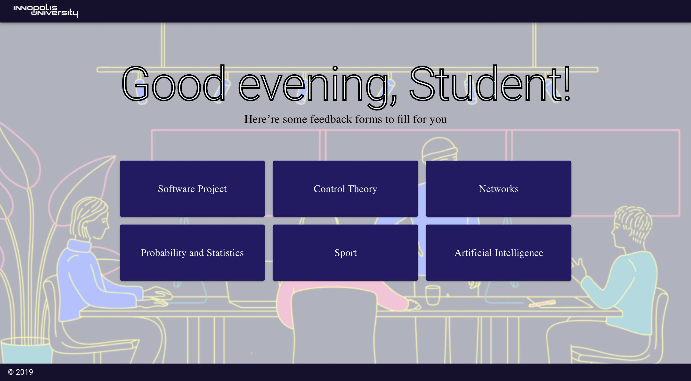

# Academic Staff Assessment
Web application for academic staff assessment. 
The goal of the project is to make anonymous feedback interface and availability to represent output data in a user-friendly format.
The main target is making web application that is available for Innopolis University-related group of students, administration and professorship to collect, process and represent data.




The development team uses vue.js with vuetify plugin for the frontend part and flask for the backend.
Instructions to launch the application on local storage with docker:

## What you should do to run the application locally
1. You need to install [Docker](https://www.docker.com/)
2. Clone this project on your computer
3. With terminal go to directory web_app_swp
4. In terminal run
```bash
docker-compose up --build
```
This command create image for this project and starts the application on [http://localhost/](http://localhost/)

### Usefull commands
P.s. If you want to rerun a container in the background, just run
```bash
docker-compose up -d <container-name>
```
P.s.2. If you want to rebuild and rerun the container
```bash
docker-compose up -d --build <container-name>
```

Possible options for `<container-name>` are:
  - backend
  - frontend
  - nginx

## Support
Write to @ma_evgor via Telegram if you have any problems with installation
